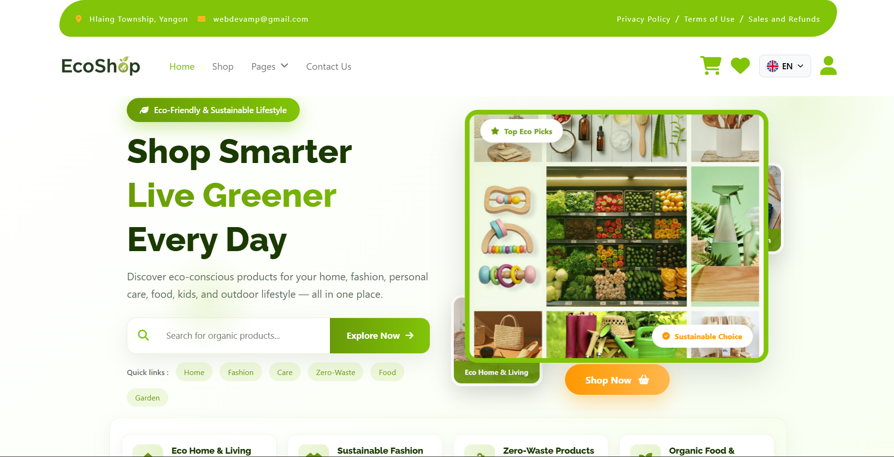
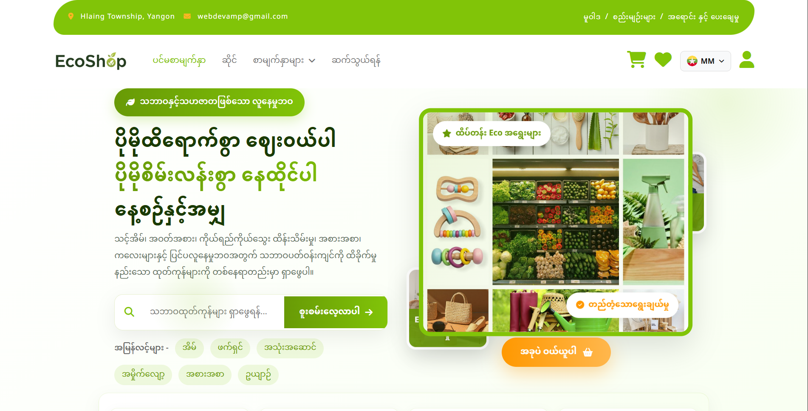

# Eco_Shop — Eco-Friendly Marketplace (v1)

A **Semester IV Laravel full-stack project** in Aung Myo Pyae's University of Information Technology portfolio. Eco_Shop provides a storefront for eco-friendly products and an administration interface for catalog and store operations.

**Release status: v1. Further upgrades are planned.** This repository documents the current implementation rather than treating the project as a finished commercial service.

## Screenshots

## Features represented in the source

### Customer storefront

- Homepage, category browsing, product search/filtering, and product details.
- Registration, login, password/account workflows, and customer profiles.
- Shopping cart, wishlist, checkout, order history, and product reviews.
- Product images, stock information, review helpfulness, and review statistics.
- English/Myanmar language switching, contact form, and newsletter subscription.
- Configurable social-login and payment integration points.

### Administration

- Dashboard and management of products, categories, stock, and orders.
- Store configuration for currencies, payment methods, shipping zones, postal codes, and tax settings.
- Role-aware routes for users, administrators, and super administrators.
- System settings and action logs.

## Technology stack

PHP 8.2+, Laravel 11, Blade templates, Eloquent, MySQL, JavaScript, Vite, and Tailwind CSS. The source also uses Laravel Socialite, the Stripe PHP SDK, and bundled frontend/admin interface assets.

## How it works

1. Requests enter Laravel through public/index.php and are dispatched by the route files.
2. Public routes display the catalog. Authenticated users are directed to the customer or administrative area according to their role.
3. Controllers coordinate validation and application actions; Eloquent models read and update the database.
4. Blade templates render the response using catalog, account, cart, or order data.
5. Database migrations define the tables. Catalog seeders provide sample categories/products, and the public storage link makes their fixture images accessible.
6. Checkout and administration use store settings such as shipping, tax, currency, and payment method configuration. External services require local environment keys and suitable account setup.

The application stores state in a database rather than relying only on browser memory. The code includes reserved-stock fields and order item records to support its checkout workflow.

## Repository guide

| Path | Purpose |
| --- | --- |
| app/Http/Controllers/ | Customer, admin, authentication, and shared request handlers |
| app/Models/ | Eloquent data models |
| routes/web.php | Shared/public routes and route registration |
| routes/user.php / routes/admin.php / routes/auth.php | Customer, admin, and authentication routes |
| database/migrations/ | Database schema history |
| database/seeders/ | Sample catalog and optional configuration seeders |
| resources/views/ | Blade templates |
| resources/ | Source styles and scripts |
| public/ | Web entry point and bundled public assets |
| storage/app/public/ | Included static catalog/frontend fixtures; local uploads are ignored |

## Local setup

Install PHP 8.2+ with the extensions required by Laravel and your database driver, Composer, Node.js/npm, and MySQL. Run from the repository root:

~~~sh
composer install
npm install
~~~

Copy .env.example to .env. Configure APP_URL and your database connection. For a typical local MySQL setup, set DB_CONNECTION=mysql and define DB_HOST, DB_PORT, DB_DATABASE, DB_USERNAME, and DB_PASSWORD. Create the empty database before migrating.

~~~sh
php artisan key:generate
php artisan migrate --seed
php artisan storage:link
npm run build
php artisan serve
~~~

Open **http://127.0.0.1:8000/**. For active frontend development, use npm run dev in a separate terminal.

The public DatabaseSeeder runs **CategorySeeder and ProductSeeder only**. It creates a sample catalog, not users or production store settings. Register your own account. For local admin exploration, open php artisan tinker and promote that registered account by setting its role to admin or superadmin and saving it; use a disposable local account. Verified routes may also require email verification. Use MAIL_MAILER=log to inspect local verification messages without sending email.

Optional store settings can be populated through the admin interface or the corresponding individual seeders after reviewing their demo defaults. Configure mail, Google/GitHub OAuth, and Stripe only in your local environment when exploring those integrations. Add the matching variables referenced by config/services.php as needed; blank credentials do not enable an integration.

## Suggested walkthrough

Browse the seeded catalog, register/sign in, add products to the wishlist/cart, and explore the checkout screens. With a local admin account, inspect catalog management and configure the settings needed by the order flow. Keep any payment experiment in a provider's test environment.

## Public-copy boundaries

The original environment file, credentials, user records, payment proof uploads, profile uploads, local databases, generated caches, Composer vendor directory, and node_modules are excluded. Sample catalog images and static frontend assets are included so a new installation can display the seeded products.

The v1 code contains integration and administration workflows, but those depend on configuration and have not all been verified end to end in this publication preparation. Further upgrades are planned.
